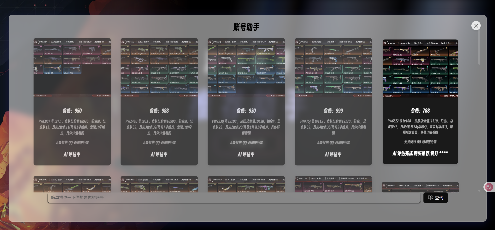

# 第十二届 NVIDIA Sky Hackathon 参赛项目 - 游戏账号智能推荐系统

## 🎯 项目概述
构建基于大语言模型的游戏账号交易推荐系统，通过多维度数据分析实现高性价比账号的智能筛选。数据源来自某头部网游交易平台实时数据。能够帮助玩家选择合适的账号，提高交易效率。

## 🧩 核心模块

### 1. 数据爬取模块
- **功能**: 每日定时爬取交易平台数据，包括：
  - 账号基础信息（价格、标题、描述）
  - 交易记录（成交价、购买者）
  - 多媒体数据（商品图片）
  - 元数据（商品链接、标签体系）
- **存储**: 结构化存储于数据库，为模型训练提供基准数据集
- **技术实现**: 
  - 基于 aiohttp 框架的分布式爬虫
  - 增量式爬取策略（每日更新昨日交易数据）
- **警告**:
  - 考虑到爬虫的特殊性。仅限学习交流，平台的js加密算法逆向没有放进开源的文件里面。有需要黑客松成员可以加我微信发你。

### 2. 前端交互模块
- **技术栈**: 
  - React 18 + Ant Design 组件库
  - CSS Modules 动画交互系统
  - 
  - 
- **核心功能**:
  - 可视化账号推荐列表
  - 多维度筛选面板
  - AI 评估状态可视化

### 3. 后端模块
- **技术架构**:
  - FastAPI 异步服务框架
  - LangChain 智能体编排系统
- **模型部署**:
  - NVIDIA NIM 平台托管
  - 模型: `nvidia/llama-3.1-nemotron-ultra-253b-v1`
- **特色功能**:
  - langchain 多服务器 MCP 客户端对接 (`MultiServerMCPClient`)
  - Langfuse 监控平台集成（调用链追踪/性能调优）
  - Pydantic 结构化输出保障数据一致性

### 4. MCP 服务模块
- **技术实现**:
  - FastMCP 服务框架封装 
  - # 核心实现代码片段（mcp_server.py）
    from fastmcp import FastMCP
    mcp = FastMCP("account assistant")  # 服务实例化

    @mcp.tool()
    async def search(p: GoodsModel) -> dict:
        return await pzds_spider.get_search(p.model_dump())  # 异步工具注册

    mcp.run(transport="streamable-http", port=9998)  # 服务配置

    graph LR
    A[客户端] -->|HTTP请求| B(MCP服务)
    B --> C{路由分发}
    C -->|/search| D[实时爬虫]
    C -->|/deal_record| E[交易数据库]

- **核心能力**:
  - 实时数据采集引擎
  - 交易参数特征抽取

## 🛠️ 运行环境
- Python 3.11
- nodejs
- npm

## 团队贡献：
- 王举伟 全部参与
- 万志强 由于要上班带娃，参与了最初方案的讨论和设计。

## 未来展望：
- 优化特征抽取的能力。提高推荐准确度。
- 用户授权coocikes，实现直接帮用户拍下性价比很高的商品。
- 时间有限，目前制作了一个平台的一个游戏 无畏契约。以后会添加更对的平台和游戏。
- 时间仓储，模块化和健壮性还有很大的提升空间